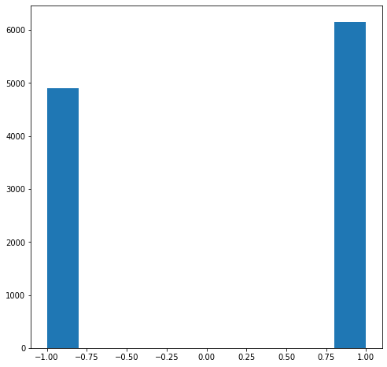
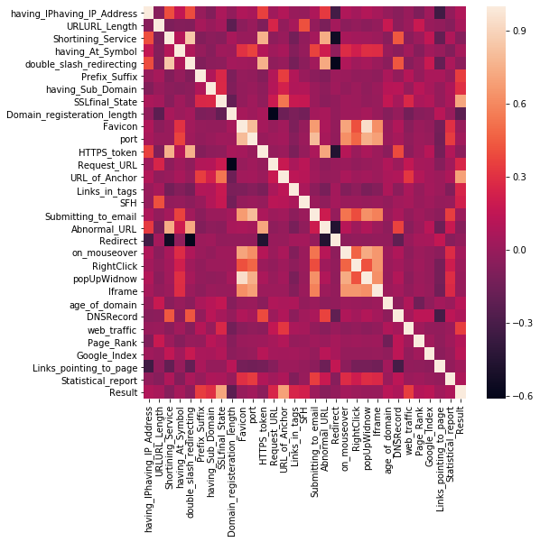
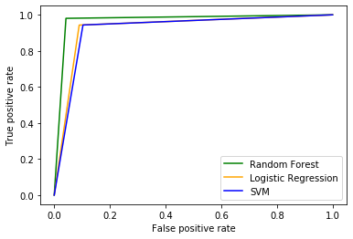

```python
import numpy as np  
import matplotlib.pyplot as plt
import pandas as pd

# Read the data
data = pd.read_csv('data/dataset.csv')

# Discarding the 'index' column
del data['index']

# View first and last 5 observations
print(data.head())
print(data.tail())
```

       having_IPhaving_IP_Address  URLURL_Length  Shortining_Service  \
    0                          -1              1                   1   
    1                           1              1                   1   
    2                           1              0                   1   
    3                           1              0                   1   
    4                           1              0                  -1   
    
       having_At_Symbol  double_slash_redirecting  Prefix_Suffix  \
    0                 1                        -1             -1   
    1                 1                         1             -1   
    2                 1                         1             -1   
    3                 1                         1             -1   
    4                 1                         1             -1   
    
       having_Sub_Domain  SSLfinal_State  Domain_registeration_length  Favicon  \
    0                 -1              -1                           -1        1   
    1                  0               1                           -1        1   
    2                 -1              -1                           -1        1   
    3                 -1              -1                            1        1   
    4                  1               1                           -1        1   
    
       ...  popUpWidnow  Iframe  age_of_domain  DNSRecord  web_traffic  Page_Rank  \
    0  ...            1       1             -1         -1           -1         -1   
    1  ...            1       1             -1         -1            0         -1   
    2  ...            1       1              1         -1            1         -1   
    3  ...            1       1             -1         -1            1         -1   
    4  ...           -1       1             -1         -1            0         -1   
    
       Google_Index  Links_pointing_to_page  Statistical_report  Result  
    0             1                       1                  -1      -1  
    1             1                       1                   1      -1  
    2             1                       0                  -1      -1  
    3             1                      -1                   1      -1  
    4             1                       1                   1       1  
    
    [5 rows x 31 columns]
           having_IPhaving_IP_Address  URLURL_Length  Shortining_Service  \
    11050                           1             -1                   1   
    11051                          -1              1                   1   
    11052                           1             -1                   1   
    11053                          -1             -1                   1   
    11054                          -1             -1                   1   
    
           having_At_Symbol  double_slash_redirecting  Prefix_Suffix  \
    11050                -1                         1              1   
    11051                -1                        -1             -1   
    11052                 1                         1             -1   
    11053                 1                         1             -1   
    11054                 1                         1             -1   
    
           having_Sub_Domain  SSLfinal_State  Domain_registeration_length  \
    11050                  1               1                           -1   
    11051                  1              -1                           -1   
    11052                  1              -1                           -1   
    11053                 -1              -1                            1   
    11054                 -1              -1                            1   
    
           Favicon  ...  popUpWidnow  Iframe  age_of_domain  DNSRecord  \
    11050       -1  ...           -1      -1              1          1   
    11051       -1  ...           -1       1              1          1   
    11052        1  ...            1       1              1          1   
    11053       -1  ...           -1       1              1          1   
    11054        1  ...            1       1             -1          1   
    
           web_traffic  Page_Rank  Google_Index  Links_pointing_to_page  \
    11050           -1         -1             1                       1   
    11051            1          1             1                      -1   
    11052            1         -1             1                       0   
    11053            1         -1             1                       1   
    11054           -1         -1            -1                       1   
    
           Statistical_report  Result  
    11050                   1       1  
    11051                   1      -1  
    11052                   1      -1  
    11053                   1      -1  
    11054                  -1      -1  
    
    [5 rows x 31 columns]


```python
# Describe statistical information of data
print(data.describe())
# Below stats show that 75 percentile of obseravtions belong to class 1 
```

           having_IPhaving_IP_Address  URLURL_Length  Shortining_Service  \
    count                11055.000000   11055.000000        11055.000000   
    mean                     0.313795      -0.633198            0.738761   
    std                      0.949534       0.766095            0.673998   
    min                     -1.000000      -1.000000           -1.000000   
    25%                     -1.000000      -1.000000            1.000000   
    50%                      1.000000      -1.000000            1.000000   
    75%                      1.000000      -1.000000            1.000000   
    max                      1.000000       1.000000            1.000000   
    
           having_At_Symbol  double_slash_redirecting  Prefix_Suffix  \
    count      11055.000000              11055.000000   11055.000000   
    mean           0.700588                  0.741474      -0.734962   
    std            0.713598                  0.671011       0.678139   
    min           -1.000000                 -1.000000      -1.000000   
    25%            1.000000                  1.000000      -1.000000   
    50%            1.000000                  1.000000      -1.000000   
    75%            1.000000                  1.000000      -1.000000   
    max            1.000000                  1.000000       1.000000   
    
           having_Sub_Domain  SSLfinal_State  Domain_registeration_length  \
    count       11055.000000    11055.000000                 11055.000000   
    mean            0.063953        0.250927                    -0.336771   
    std             0.817518        0.911892                     0.941629   
    min            -1.000000       -1.000000                    -1.000000   
    25%            -1.000000       -1.000000                    -1.000000   
    50%             0.000000        1.000000                    -1.000000   
    75%             1.000000        1.000000                     1.000000   
    max             1.000000        1.000000                     1.000000   
    
                Favicon  ...   popUpWidnow        Iframe  age_of_domain  \
    count  11055.000000  ...  11055.000000  11055.000000   11055.000000   
    mean       0.628584  ...      0.613388      0.816915       0.061239   
    std        0.777777  ...      0.789818      0.576784       0.998168   
    min       -1.000000  ...     -1.000000     -1.000000      -1.000000   
    25%        1.000000  ...      1.000000      1.000000      -1.000000   
    50%        1.000000  ...      1.000000      1.000000       1.000000   
    75%        1.000000  ...      1.000000      1.000000       1.000000   
    max        1.000000  ...      1.000000      1.000000       1.000000   
    
              DNSRecord   web_traffic     Page_Rank  Google_Index  \
    count  11055.000000  11055.000000  11055.000000  11055.000000   
    mean       0.377114      0.287291     -0.483673      0.721574   
    std        0.926209      0.827733      0.875289      0.692369   
    min       -1.000000     -1.000000     -1.000000     -1.000000   
    25%       -1.000000      0.000000     -1.000000      1.000000   
    50%        1.000000      1.000000     -1.000000      1.000000   
    75%        1.000000      1.000000      1.000000      1.000000   
    max        1.000000      1.000000      1.000000      1.000000   
    
           Links_pointing_to_page  Statistical_report        Result  
    count            11055.000000        11055.000000  11055.000000  
    mean                 0.344007            0.719584      0.113885  
    std                  0.569944            0.694437      0.993539  
    min                 -1.000000           -1.000000     -1.000000  
    25%                  0.000000            1.000000     -1.000000  
    50%                  0.000000            1.000000      1.000000  
    75%                  1.000000            1.000000      1.000000  
    max                  1.000000            1.000000      1.000000  
    
    [8 rows x 31 columns]


```python
# Check column types
print(data.info())               

# All comumns are int type, so no change is required
```

    <class 'pandas.core.frame.DataFrame'>
    RangeIndex: 11055 entries, 0 to 11054
    Data columns (total 31 columns):
    having_IPhaving_IP_Address     11055 non-null int64
    URLURL_Length                  11055 non-null int64
    Shortining_Service             11055 non-null int64
    having_At_Symbol               11055 non-null int64
    double_slash_redirecting       11055 non-null int64
    Prefix_Suffix                  11055 non-null int64
    having_Sub_Domain              11055 non-null int64
    SSLfinal_State                 11055 non-null int64
    Domain_registeration_length    11055 non-null int64
    Favicon                        11055 non-null int64
    port                           11055 non-null int64
    HTTPS_token                    11055 non-null int64
    Request_URL                    11055 non-null int64
    URL_of_Anchor                  11055 non-null int64
    Links_in_tags                  11055 non-null int64
    SFH                            11055 non-null int64
    Submitting_to_email            11055 non-null int64
    Abnormal_URL                   11055 non-null int64
    Redirect                       11055 non-null int64
    on_mouseover                   11055 non-null int64
    RightClick                     11055 non-null int64
    popUpWidnow                    11055 non-null int64
    Iframe                         11055 non-null int64
    age_of_domain                  11055 non-null int64
    DNSRecord                      11055 non-null int64
    web_traffic                    11055 non-null int64
    Page_Rank                      11055 non-null int64
    Google_Index                   11055 non-null int64
    Links_pointing_to_page         11055 non-null int64
    Statistical_report             11055 non-null int64
    Result                         11055 non-null int64
    dtypes: int64(31)
    memory usage: 2.6 MB
    None


```python
# Plot distribution of classes using Histograms
plt.figure(figsize =(8,8))
plt.hist(data.Result)           

# It shows that benign class have about 1000+ observations than malware
```


    (array([4898.,    0.,    0.,    0.,    0.,    0.,    0.,    0.,    0.,
            6157.]),
     array([-1. , -0.8, -0.6, -0.4, -0.2,  0. ,  0.2,  0.4,  0.6,  0.8,  1. ]),
     <a list of 10 Patch objects>)





```python
# Look for missing values
print(data.isnull().sum())        

# No missing values found, so no need to drop or replace any value
```

    having_IPhaving_IP_Address     0
    URLURL_Length                  0
    Shortining_Service             0
    having_At_Symbol               0
    double_slash_redirecting       0
    Prefix_Suffix                  0
    having_Sub_Domain              0
    SSLfinal_State                 0
    Domain_registeration_length    0
    Favicon                        0
    port                           0
    HTTPS_token                    0
    Request_URL                    0
    URL_of_Anchor                  0
    Links_in_tags                  0
    SFH                            0
    Submitting_to_email            0
    Abnormal_URL                   0
    Redirect                       0
    on_mouseover                   0
    RightClick                     0
    popUpWidnow                    0
    Iframe                         0
    age_of_domain                  0
    DNSRecord                      0
    web_traffic                    0
    Page_Rank                      0
    Google_Index                   0
    Links_pointing_to_page         0
    Statistical_report             0
    Result                         0
    dtype: int64


```python
# Generate correlation matrix
print(data.corr())

import seaborn as sns
plt.figure(figsize =(8,8))
sns.heatmap(data.corr())    # Generate heatmap (though very less clarity due to large no. of ftrs
```

                                 having_IPhaving_IP_Address  URLURL_Length  \
    having_IPhaving_IP_Address                     1.000000      -0.052411   
    URLURL_Length                                 -0.052411       1.000000   
    Shortining_Service                             0.403461      -0.097881   
    having_At_Symbol                               0.158699      -0.075108   
    double_slash_redirecting                       0.397389      -0.081247   
    Prefix_Suffix                                 -0.005257       0.055247   
    having_Sub_Domain                             -0.080745       0.003997   
    SSLfinal_State                                 0.071414       0.048754   
    Domain_registeration_length                   -0.022739      -0.221892   
    Favicon                                        0.087025      -0.042497   
    port                                           0.060979       0.000323   
    HTTPS_token                                    0.363534      -0.089383   
    Request_URL                                    0.029773       0.246348   
    URL_of_Anchor                                  0.099847      -0.023396   
    Links_in_tags                                  0.006212       0.052869   
    SFH                                           -0.010962       0.414196   
    Submitting_to_email                            0.077989      -0.014457   
    Abnormal_URL                                   0.336549      -0.106761   
    Redirect                                      -0.321181       0.046832   
    on_mouseover                                   0.084059      -0.045103   
    RightClick                                     0.042881      -0.013613   
    popUpWidnow                                    0.096882      -0.049381   
    Iframe                                         0.054694      -0.013838   
    age_of_domain                                 -0.010446       0.179426   
    DNSRecord                                     -0.050733      -0.040823   
    web_traffic                                    0.002922       0.008993   
    Page_Rank                                     -0.091774       0.183518   
    Google_Index                                   0.029153       0.002902   
    Links_pointing_to_page                        -0.339065      -0.022987   
    Statistical_report                            -0.019103      -0.067153   
    Result                                         0.094160       0.057430   
    
                                 Shortining_Service  having_At_Symbol  \
    having_IPhaving_IP_Address             0.403461          0.158699   
    URLURL_Length                         -0.097881         -0.075108   
    Shortining_Service                     1.000000          0.104447   
    having_At_Symbol                       0.104447          1.000000   
    double_slash_redirecting               0.842796          0.086960   
    Prefix_Suffix                         -0.080471         -0.011726   
    having_Sub_Domain                     -0.041916         -0.058976   
    SSLfinal_State                        -0.061426          0.031220   
    Domain_registeration_length            0.060923          0.015522   
    Favicon                                0.006101          0.304899   
    port                                   0.002201          0.364891   
    HTTPS_token                            0.757838          0.104561   
    Request_URL                           -0.037235          0.027909   
    URL_of_Anchor                          0.000561          0.057914   
    Links_in_tags                         -0.133379         -0.070861   
    SFH                                   -0.022723         -0.008672   
    Submitting_to_email                    0.049328          0.370123   
    Abnormal_URL                           0.739290          0.203945   
    Redirect                              -0.534530         -0.028160   
    on_mouseover                           0.062383          0.279697   
    RightClick                             0.038118          0.219503   
    popUpWidnow                            0.036616          0.290893   
    Iframe                                 0.016581          0.284410   
    age_of_domain                         -0.052596         -0.005499   
    DNSRecord                              0.436064         -0.047872   
    web_traffic                           -0.047074          0.032918   
    Page_Rank                              0.014591         -0.064735   
    Google_Index                           0.155844          0.037061   
    Links_pointing_to_page                -0.198410         -0.006080   
    Statistical_report                     0.085461         -0.080357   
    Result                                -0.067966          0.052948   
    
                                 double_slash_redirecting  Prefix_Suffix  \
    having_IPhaving_IP_Address                   0.397389      -0.005257   
    URLURL_Length                               -0.081247       0.055247   
    Shortining_Service                           0.842796      -0.080471   
    having_At_Symbol                             0.086960      -0.011726   
    double_slash_redirecting                     1.000000      -0.085590   
    Prefix_Suffix                               -0.085590       1.000000   
    having_Sub_Domain                           -0.043079       0.087891   
    SSLfinal_State                              -0.036200       0.261391   
    Domain_registeration_length                  0.047464      -0.096799   
    Favicon                                      0.035100      -0.007504   
    port                                         0.025060      -0.022546   
    HTTPS_token                                  0.760799      -0.070153   
    Request_URL                                 -0.026368       0.098675   
    URL_of_Anchor                               -0.005036       0.348871   
    Links_in_tags                               -0.125583       0.100254   
    SFH                                         -0.041672       0.001326   
    Submitting_to_email                          0.031898      -0.045000   
    Abnormal_URL                                 0.723724      -0.077620   
    Redirect                                    -0.591478       0.016271   
    on_mouseover                                 0.086635       0.012578   
    RightClick                                   0.025863      -0.024868   
    popUpWidnow                                  0.054463      -0.014733   
    Iframe                                       0.010459      -0.036904   
    age_of_domain                               -0.050107       0.074116   
    DNSRecord                                    0.431409      -0.016556   
    web_traffic                                 -0.062369       0.110598   
    Page_Rank                                   -0.003132      -0.006834   
    Google_Index                                 0.178415       0.067781   
    Links_pointing_to_page                      -0.194165       0.067423   
    Statistical_report                           0.070390      -0.002763   
    Result                                      -0.038608       0.348606   
    
                                 having_Sub_Domain  SSLfinal_State  \
    having_IPhaving_IP_Address           -0.080745        0.071414   
    URLURL_Length                         0.003997        0.048754   
    Shortining_Service                   -0.041916       -0.061426   
    having_At_Symbol                     -0.058976        0.031220   
    double_slash_redirecting             -0.043079       -0.036200   
    Prefix_Suffix                         0.087891        0.261391   
    having_Sub_Domain                     1.000000        0.267649   
    SSLfinal_State                        0.267649        1.000000   
    Domain_registeration_length          -0.082839       -0.193622   
    Favicon                              -0.016704       -0.014757   
    port                                  0.004863        0.027473   
    HTTPS_token                          -0.037239       -0.029941   
    Request_URL                           0.104857        0.193054   
    URL_of_Anchor                         0.229491        0.535786   
    Links_in_tags                         0.093646        0.176825   
    SFH                                   0.096089        0.171402   
    Submitting_to_email                   0.008830        0.008062   
    Abnormal_URL                         -0.034908       -0.046245   
    Redirect                              0.031206       -0.021070   
    on_mouseover                         -0.018082        0.023586   
    RightClick                            0.018230        0.015854   
    popUpWidnow                          -0.025312       -0.013005   
    Iframe                                0.010637       -0.002773   
    age_of_domain                         0.119254        0.162809   
    DNSRecord                             0.125493        0.050972   
    web_traffic                          -0.005764        0.258768   
    Page_Rank                             0.120730        0.074545   
    Google_Index                          0.057673        0.096051   
    Links_pointing_to_page               -0.010526       -0.011710   
    Statistical_report                    0.081627        0.063411   
    Result                                0.298323        0.714741   
    
                                 Domain_registeration_length   Favicon  ...  \
    having_IPhaving_IP_Address                     -0.022739  0.087025  ...   
    URLURL_Length                                  -0.221892 -0.042497  ...   
    Shortining_Service                              0.060923  0.006101  ...   
    having_At_Symbol                                0.015522  0.304899  ...   
    double_slash_redirecting                        0.047464  0.035100  ...   
    Prefix_Suffix                                  -0.096799 -0.007504  ...   
    having_Sub_Domain                              -0.082839 -0.016704  ...   
    SSLfinal_State                                 -0.193622 -0.014757  ...   
    Domain_registeration_length                     1.000000  0.054253  ...   
    Favicon                                         0.054253  1.000000  ...   
    port                                            0.022478  0.803834  ...   
    HTTPS_token                                     0.059161  0.049483  ...   
    Request_URL                                    -0.609970 -0.004620  ...   
    URL_of_Anchor                                  -0.160257  0.037698  ...   
    Links_in_tags                                  -0.101084 -0.100341  ...   
    SFH                                            -0.136422 -0.012279  ...   
    Submitting_to_email                             0.039260  0.668317  ...   
    Abnormal_URL                                    0.058109  0.071848  ...   
    Redirect                                       -0.016300 -0.015621  ...   
    on_mouseover                                    0.023784  0.706179  ...   
    RightClick                                      0.023520  0.414382  ...   
    popUpWidnow                                     0.051410  0.939633  ...   
    Iframe                                          0.004393  0.627607  ...   
    age_of_domain                                  -0.062851 -0.002628  ...   
    DNSRecord                                      -0.010477  0.088211  ...   
    web_traffic                                    -0.134454 -0.050922  ...   
    Page_Rank                                      -0.059898  0.011699  ...   
    Google_Index                                   -0.039766 -0.016668  ...   
    Links_pointing_to_page                          0.122672 -0.127243  ...   
    Statistical_report                             -0.002212  0.300917  ...   
    Result                                         -0.225789 -0.000280  ...   
    
                                 popUpWidnow    Iframe  age_of_domain  DNSRecord  \
    having_IPhaving_IP_Address      0.096882  0.054694      -0.010446  -0.050733   
    URLURL_Length                  -0.049381 -0.013838       0.179426  -0.040823   
    Shortining_Service              0.036616  0.016581      -0.052596   0.436064   
    having_At_Symbol                0.290893  0.284410      -0.005499  -0.047872   
    double_slash_redirecting        0.054463  0.010459      -0.050107   0.431409   
    Prefix_Suffix                  -0.014733 -0.036904       0.074116  -0.016556   
    having_Sub_Domain              -0.025312  0.010637       0.119254   0.125493   
    SSLfinal_State                 -0.013005 -0.002773       0.162809   0.050972   
    Domain_registeration_length     0.051410  0.004393      -0.062851  -0.010477   
    Favicon                         0.939633  0.627607      -0.002628   0.088211   
    port                            0.748517  0.687044       0.008459   0.054849   
    HTTPS_token                     0.066957  0.017509      -0.049632   0.395387   
    Request_URL                    -0.004622  0.016934       0.090455   0.015933   
    URL_of_Anchor                   0.041150  0.013403       0.075508   0.093288   
    Links_in_tags                  -0.112282 -0.070030       0.078057  -0.038545   
    SFH                            -0.004863  0.007067      -0.015840   0.034440   
    Submitting_to_email             0.629462  0.577490       0.007357   0.064145   
    Abnormal_URL                    0.091188  0.017590      -0.032533   0.366833   
    Redirect                       -0.026327 -0.012668      -0.022476  -0.211096   
    on_mouseover                    0.733629  0.659478       0.013306   0.087161   
    RightClick                      0.415268  0.655863       0.006764   0.038255   
    popUpWidnow                     1.000000  0.629406      -0.000948   0.098658   
    Iframe                          0.629406  1.000000       0.018848   0.047293   
    age_of_domain                  -0.000948  0.018848       1.000000  -0.034082   
    DNSRecord                       0.098658  0.047293      -0.034082   1.000000   
    web_traffic                    -0.043190 -0.022080       0.089949   0.048650   
    Page_Rank                       0.017114  0.022407      -0.147194   0.137860   
    Google_Index                   -0.010256 -0.003519      -0.028471   0.137509   
    Links_pointing_to_page         -0.121325 -0.140824       0.040407  -0.318266   
    Statistical_report              0.285261  0.268418       0.009115   0.136860   
    Result                          0.000086 -0.003394       0.121496   0.075718   
    
                                 web_traffic  Page_Rank  Google_Index  \
    having_IPhaving_IP_Address      0.002922  -0.091774      0.029153   
    URLURL_Length                   0.008993   0.183518      0.002902   
    Shortining_Service             -0.047074   0.014591      0.155844   
    having_At_Symbol                0.032918  -0.064735      0.037061   
    double_slash_redirecting       -0.062369  -0.003132      0.178415   
    Prefix_Suffix                   0.110598  -0.006834      0.067781   
    having_Sub_Domain              -0.005764   0.120730      0.057673   
    SSLfinal_State                  0.258768   0.074545      0.096051   
    Domain_registeration_length    -0.134454  -0.059898     -0.039766   
    Favicon                        -0.050922   0.011699     -0.016668   
    port                           -0.028543   0.017954     -0.005413   
    HTTPS_token                    -0.039708   0.021104      0.115450   
    Request_URL                     0.161166   0.055734      0.046409   
    URL_of_Anchor                   0.326293   0.099261      0.038816   
    Links_in_tags                   0.064548  -0.006450      0.045557   
    SFH                             0.052706   0.001979      0.027588   
    Submitting_to_email            -0.015685   0.026208     -0.008378   
    Abnormal_URL                   -0.052416   0.007318      0.124751   
    Redirect                        0.004631   0.052867      0.057230   
    on_mouseover                   -0.036531   0.015634     -0.006510   
    RightClick                     -0.013594   0.025341     -0.008066   
    popUpWidnow                    -0.043190   0.017114     -0.010256   
    Iframe                         -0.022080   0.022407     -0.003519   
    age_of_domain                   0.089949  -0.147194     -0.028471   
    DNSRecord                       0.048650   0.137860      0.137509   
    web_traffic                     1.000000   0.030984     -0.012584   
    Page_Rank                       0.030984   1.000000      0.032431   
    Google_Index                   -0.012584   0.032431      1.000000   
    Links_pointing_to_page         -0.019860  -0.028216     -0.038777   
    Statistical_report              0.009223   0.031049     -0.005103   
    Result                          0.346103   0.104645      0.128950   
    
                                 Links_pointing_to_page  Statistical_report  \
    having_IPhaving_IP_Address                -0.339065           -0.019103   
    URLURL_Length                             -0.022987           -0.067153   
    Shortining_Service                        -0.198410            0.085461   
    having_At_Symbol                          -0.006080           -0.080357   
    double_slash_redirecting                  -0.194165            0.070390   
    Prefix_Suffix                              0.067423           -0.002763   
    having_Sub_Domain                         -0.010526            0.081627   
    SSLfinal_State                            -0.011710            0.063411   
    Domain_registeration_length                0.122672           -0.002212   
    Favicon                                   -0.127243            0.300917   
    port                                      -0.139104            0.343987   
    HTTPS_token                               -0.128724            0.096187   
    Request_URL                               -0.067109            0.035412   
    URL_of_Anchor                              0.018651            0.077377   
    Links_in_tags                              0.013561           -0.087343   
    SFH                                       -0.009068           -0.005289   
    Submitting_to_email                       -0.039956            0.352074   
    Abnormal_URL                              -0.161027            0.186399   
    Redirect                                   0.161278           -0.059194   
    on_mouseover                              -0.038551            0.277347   
    RightClick                                -0.119831            0.204409   
    popUpWidnow                               -0.121325            0.285261   
    Iframe                                    -0.140824            0.268418   
    age_of_domain                              0.040407            0.009115   
    DNSRecord                                 -0.318266            0.136860   
    web_traffic                               -0.019860            0.009223   
    Page_Rank                                 -0.028216            0.031049   
    Google_Index                              -0.038777           -0.005103   
    Links_pointing_to_page                     1.000000           -0.016817   
    Statistical_report                        -0.016817            1.000000   
    Result                                     0.032574            0.079857   
    
                                   Result  
    having_IPhaving_IP_Address   0.094160  
    URLURL_Length                0.057430  
    Shortining_Service          -0.067966  
    having_At_Symbol             0.052948  
    double_slash_redirecting    -0.038608  
    Prefix_Suffix                0.348606  
    having_Sub_Domain            0.298323  
    SSLfinal_State               0.714741  
    Domain_registeration_length -0.225789  
    Favicon                     -0.000280  
    port                         0.036419  
    HTTPS_token                 -0.039854  
    Request_URL                  0.253372  
    URL_of_Anchor                0.692935  
    Links_in_tags                0.248229  
    SFH                          0.221419  
    Submitting_to_email          0.018249  
    Abnormal_URL                -0.060488  
    Redirect                    -0.020113  
    on_mouseover                 0.041838  
    RightClick                   0.012653  
    popUpWidnow                  0.000086  
    Iframe                      -0.003394  
    age_of_domain                0.121496  
    DNSRecord                    0.075718  
    web_traffic                  0.346103  
    Page_Rank                    0.104645  
    Google_Index                 0.128950  
    Links_pointing_to_page       0.032574  
    Statistical_report           0.079857  
    Result                       1.000000  
    
    [31 rows x 31 columns]


    <matplotlib.axes._subplots.AxesSubplot at 0x7f75fb2fc550>





```python
print(data.corr()['Result'].sort_values())      # Print correlation with target variable
```

    Domain_registeration_length   -0.225789
    Shortining_Service            -0.067966
    Abnormal_URL                  -0.060488
    HTTPS_token                   -0.039854
    double_slash_redirecting      -0.038608
    Redirect                      -0.020113
    Iframe                        -0.003394
    Favicon                       -0.000280
    popUpWidnow                    0.000086
    RightClick                     0.012653
    Submitting_to_email            0.018249
    Links_pointing_to_page         0.032574
    port                           0.036419
    on_mouseover                   0.041838
    having_At_Symbol               0.052948
    URLURL_Length                  0.057430
    DNSRecord                      0.075718
    Statistical_report             0.079857
    having_IPhaving_IP_Address     0.094160
    Page_Rank                      0.104645
    age_of_domain                  0.121496
    Google_Index                   0.128950
    SFH                            0.221419
    Links_in_tags                  0.248229
    Request_URL                    0.253372
    having_Sub_Domain              0.298323
    web_traffic                    0.346103
    Prefix_Suffix                  0.348606
    URL_of_Anchor                  0.692935
    SSLfinal_State                 0.714741
    Result                         1.000000
    Name: Result, dtype: float64


```python
# Remove features having correlation coeff. between +/- 0.03
data.drop(['Favicon','Iframe','Redirect',
                'popUpWidnow','RightClick','Submitting_to_email'],axis=1,inplace=True)
print(len(data.columns))
```

    25


```python
# Prepare data for models
y = data['Result'].values
X = data.drop(['Result'], axis = 1)

from sklearn.metrics import accuracy_score,roc_curve,auc, confusion_matrix
from sklearn import preprocessing
from sklearn.model_selection import train_test_split

# Split the data as training and testing data - 70% train size, 30% test size
X_train, X_test, y_train, y_test  = train_test_split(X, y, test_size = 0.3, random_state = None)
```


```python
from sklearn.ensemble import RandomForestClassifier
rfc = RandomForestClassifier()
rfc = rfc.fit(X_train,y_train)
prediction = rfc.predict(X_test)
print("Accuracy with RF classifier:",accuracy_score(y_test, prediction)) 
fpr,tpr,thresh = roc_curve(y_test,prediction)      
roc_auc = accuracy_score(y_test,prediction)         # Calculate ROC AUC

# Plot ROC curve for Random Forest
plt.plot(fpr,tpr,'g',label = 'Random Forest')
plt.legend("Random Forest", loc='lower right')
plt.legend(loc='lower right')
print("Conf matrix RF classifier:",confusion_matrix(y_test,prediction))  #  Generate confusion matrix

#2 Classification using logistic regression
from sklearn.linear_model import LogisticRegression
logreg = LogisticRegression()
logreg = logreg.fit(X_train,y_train)
prediction = logreg.predict(X_test)
print("Accuracy with Log Reg:", accuracy_score(y_test, prediction))
print ("Conf matrix Log Reg:",confusion_matrix(y_test,prediction))
fpr,tpr,thresh = roc_curve(y_test,prediction)
roc_auc = accuracy_score(y_test,prediction)

# Plot ROC curve for Logistic Regression
plt.plot(fpr,tpr,'orange',label = 'Logistic Regression')
plt.legend("Logistic Regression", loc='lower right')
plt.xlabel("False positive rate")
plt.ylabel("True positive rate")
plt.legend(loc='lower right')

#3 Classification using SVM
from sklearn.svm import SVC
svc_l = SVC(kernel = "linear", C = 0.025)
svc_l = svc_l.fit(X_train,y_train)
prediction = svc_l.predict(X_test)
print("Accuracy with SVM-Linear:",accuracy_score(y_test, prediction))
fpr,tpr,thresh = roc_curve(y_test,prediction)
roc_auc = accuracy_score(y_test,prediction)

# Plot ROC curve for SVM-linear
plt.plot(fpr,tpr,'b',label = 'SVM')
plt.legend("SVM", loc ='lower right')
plt.legend(loc ='lower right')
print("Conf matrix SVM-linear:",confusion_matrix(y_test,prediction))

plt.show()

'''
# -------- Apply Recursive Feature Elimination(RFE) and use reduced feature set for prediction ------------------------
# Recursive Feature Elimination(RFE) is a technique that takes entire feature set as input and removes features one at 
# a time up to a specified number or until a stopping criteria is met.
'''
from sklearn.feature_selection import RFE
rfe = RFE(rfc,27)                              
rfe = rfe.fit(X_train, y_train)               # Train RF classifier with only 27 features now
pred = rfe.predict(X_test)

# Test accuracy on reduced data
print("Accuracy by RFClassifier after RFE is applied:", accuracy_score(y_test,pred))

rfe = RFE(svc_l,27)
rfe = rfe.fit(X_train, y_train)               # Train SVM with only 27 features now
pred = rfe.predict(X_test)
print("Accuracy by SVM-Linear after RFE is applied:", accuracy_score(y_test,pred))

rfe = RFE(logreg,27)
rfe = rfe.fit(X_train, y_train)              # Train Logistic-Reg with only 27 features now
pred = rfe.predict(X_test)
print("Accuracy by Logistic Regression after RFE is applied:", accuracy_score(y_test,pred))
```

    /home/ri/anaconda3/lib/python3.7/site-packages/sklearn/ensemble/forest.py:245: FutureWarning: The default value of n_estimators will change from 10 in version 0.20 to 100 in 0.22.
      "10 in version 0.20 to 100 in 0.22.", FutureWarning)
    /home/ri/anaconda3/lib/python3.7/site-packages/sklearn/linear_model/logistic.py:432: FutureWarning: Default solver will be changed to 'lbfgs' in 0.22. Specify a solver to silence this warning.
      FutureWarning)


    Accuracy with RF classifier: 0.9704552306300874
    Conf matrix RF classifier: [[1409   62]
     [  36 1810]]
    Accuracy with Log Reg: 0.9285498944829665
    Conf matrix Log Reg: [[1339  132]
     [ 105 1741]]
    Accuracy with SVM-Linear: 0.9228218269520652
    Conf matrix SVM-linear: [[1319  152]
     [ 104 1742]]





    Accuracy by RFClassifier after RFE is applied: 0.9722640940608984
    Accuracy by SVM-Linear after RFE is applied: 0.9228218269520652
    Accuracy by Logistic Regression after RFE is applied: 0.9285498944829665


    /home/ri/anaconda3/lib/python3.7/site-packages/sklearn/linear_model/logistic.py:432: FutureWarning: Default solver will be changed to 'lbfgs' in 0.22. Specify a solver to silence this warning.
      FutureWarning)

